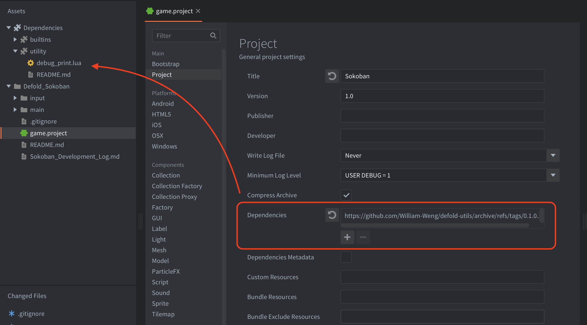

# defold-utils

個人常用的 Defold 工具集合。

此專案將可重用的 Defold Lua modules、遊戲開發 helper，以及未來可能加入的 GUI、Input、Save、Audio 等元件集中管理，方便在不同 Defold 專案中透過 Library Dependencies 重複使用。

> 目前仍在持續整理與擴充中。

## Features

- 輕量、零第三方 Lua 依賴
- 可作為 Defold Library Dependency 使用
- 使用 `require()` 引入各個 module
- 盡量避免建立全域變數
- 適合放置跨專案可重用的工具與元件

## Installation

在你的 Defold 專案中開啟 `game.project`，於 **Dependencies** 加入此 repository 的 ZIP URL：

```text
https://github.com/William-Weng/defold-utils/archive/refs/tags/0.1.0.zip
```



然後在 Defold Editor 執行：

```text
Project → Fetch Libraries
```

建議引用固定版本 tag，而不是 `main.zip`，避免 library 更新後意外影響既有遊戲。

## Project Structure

```text
defold-utils/
├── game.project
├── utility/
│   └── debug_print.lua
└── README.md
```

`game.project` 需要公開要提供給其他專案使用的資料夾：

```ini
[library]
include_dirs = utility
```
